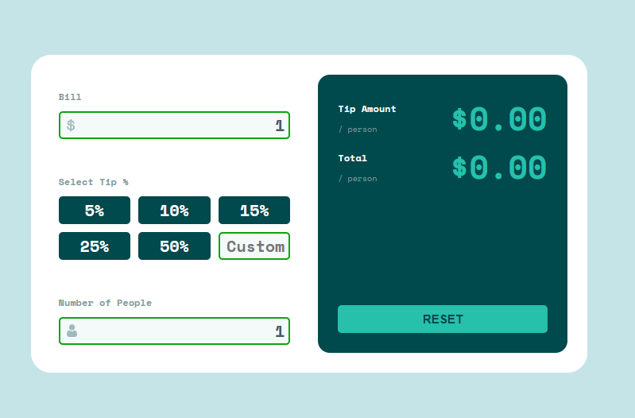
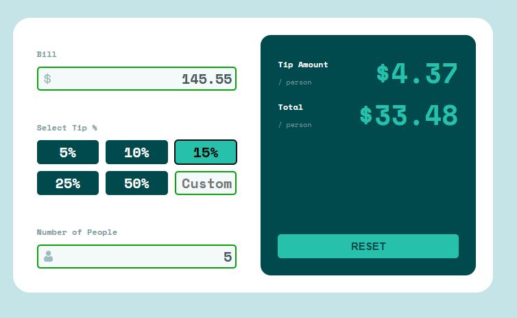

# Tip Calculator
This is a simple tip calculator built using React.

## Features
* Calculate the tip and total amount per person
* Option to split the bill between multiple people
* Ability to input a custom tip percentage
* Reset button to start over

## Technologies Used
* React
* TypeScript
* CSS

## Installation
1. Clone the repository: `git clone https://github.com/YOUR-USERNAME/tip-calculator.git`
2. Install the dependencies: `npm install`
3. Start the development server: `npm start`

## Usage
1. Input the bill amount in the "Bill" field.
2. Select the tip percentage from the preset buttons or input a custom percentage.
3. Input the number of people to split the bill between.
4. The app will automatically calculate the tip amount and total per person.
5. Click the "RESET" button to start over.

## Screenshots

## Contributing
Contributions are always welcome! If you have any suggestions or find any bugs, please open an issue or a pull request.

## License
This project is licensed under the MIT License - see the LICENSE file for details.